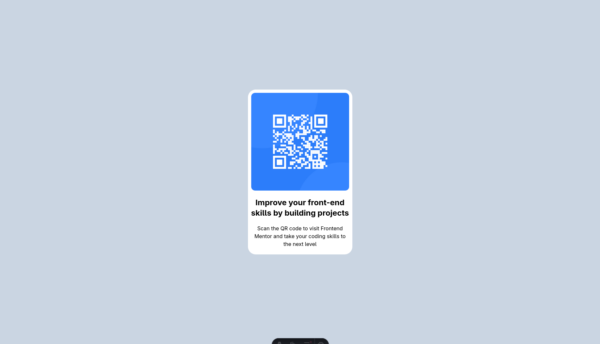

# Frontend Mentor - QR code component solution

This is a solution to the [QR code component challenge on Frontend Mentor](https://www.frontendmentor.io/challenges/qr-code-component-iux_sIO_H). Frontend Mentor challenges help you improve your coding skills by building realistic projects.

## Table of contents

- [Overview](#overview)
  - [Screenshot](#screenshot)
  - [Links](#links)
- [My process](#my-process)
  - [Built with](#built-with)
  - [What I learned](#what-i-learned)
  - [Continued development](#continued-development)
  - [Useful resources](#useful-resources)
- [Author](#author)

## Overview

### Screenshot

### Links

- Solution URL: [GitHub Repository](https://github.com/your-username/qr-code-component)
- Live Site URL: [GitHub Pages](https://your-username.github.io/qr-code-component/)

## My process

### Built with

- Semantic HTML5 markup
- [Astro](https://astro.build/) - Static site generator
- [Tailwind CSS](https://tailwindcss.com/) - Utility-first CSS framework
- Mobile-first workflow

### What I learned

Building a simple component with Astro and Tailwind CSS, focusing on semantic structure and responsive layout.

### Continued development

Continue practicing with Astro and Tailwind CSS on more complex Frontend Mentor challenges.

### Useful resources

- [Astro Documentation](https://docs.astro.build/)
- [Tailwind CSS Documentation](https://tailwindcss.com/docs)
- [Outfit Font - Google Fonts](https://fonts.google.com/specimen/Outfit)

## Author

- Frontend Mentor - [@FraVelz](https://www.frontendmentor.io/profile/FraVelz)
